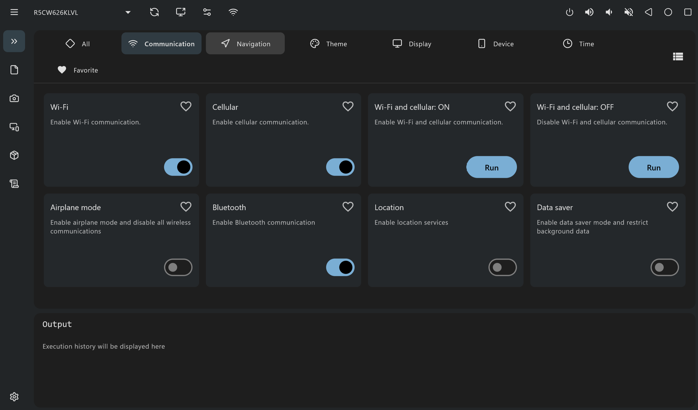

#  QA-Adbpad

QA-Adbpad is a GUI tool designed to streamline Android app testing using ADB, forked from
[AdbPad](https://github.com/kaleidot725/adbpad) by [kaleidot725](https://github.com/kaleidot725)
with fixes and features for testing against Android TV devices. See [CHANGES.md](CHANGES.md) for
what changed from upstream and why.

> [!NOTE]
> This fork has been built and tested on Windows only. The macOS/Linux build targets from
> upstream are still configured but unverified here - see [CHANGES.md](CHANGES.md) if you want to
> pick that up.



# ✨ Features

- **Device Management**: View a list of connected Android devices, including Android TV, with a
  liveness check (is the device actually responsive, not just ADB-linked) and a real-reboot
  restart button.
- **ADB Command Execution**: Run ADB shell commands effortlessly.
- **Toggle Commands**: One-click switches for On/Off device settings (Wi-Fi, Bluetooth, Airplane
  mode, Dark theme, and more) that reflect the device's actual current state.
- **Text Input**: Send text input to your Android device.
- **Screenshots**: Capture a screenshot with one click, verified working on Android TV. Newest
  captures appear on top, each row shows which device it came from, and you can multi-select and
  bulk-delete screenshots.
- **Wireless ADB**: Connect and pair over Wi-Fi without a terminal.
- **Scrcpy Mirroring**: Low/Mid/High quality tiers (editable presets), plus an auto-profiler that
  scans a problem device's encoders and derives a working custom profile for hardware that
  freezes on the fixed tiers.
- **Log Capture**: Start/stop `logcat` capture tied to a test session, with a Save As prompt for
  where to put each capture.
- **Virtual Display**: Create virtual displays to test on large-screen environments (requires
  Android 14+ on the device).
- **Check for Updates**: One click in Settings to check the latest GitHub release and launch its
  installer.

# ⬇️ Installation

1. Download the latest installer from the [Releases page](https://github.com/TonciZ/QA-Adbpad/releases/).
2. Launch the application and configure the ADB path in the **Settings**.

# 🎫 License

Forked from [AdbPad](https://github.com/kaleidot725/adbpad), originally MIT licensed. This fork
remains under the same license.

```
MIT License

Copyright (c) 2025 Yusuke Katsuragawa
Modifications Copyright (c) 2026 TonciZ

Permission is hereby granted, free of charge, to any person obtaining a copy
of this software and associated documentation files (the "Software"), to deal
in the Software without restriction, including without limitation the rights
to use, copy, modify, merge, publish, distribute, sublicense, and/or sell
copies of the Software, and to permit persons to whom the Software is
furnished to do so, subject to the following conditions:

The above copyright notice and this permission notice shall be included in all
copies or substantial portions of the Software.

THE SOFTWARE IS PROVIDED "AS IS", WITHOUT WARRANTY OF ANY KIND, EXPRESS OR
IMPLIED, INCLUDING BUT NOT LIMITED TO THE WARRANTIES OF MERCHANTABILITY,
FITNESS FOR A PARTICULAR PURPOSE AND NONINFRINGEMENT. IN NO EVENT SHALL THE
AUTHORS OR COPYRIGHT HOLDERS BE LIABLE FOR ANY CLAIM, DAMAGES OR OTHER
LIABILITY, WHETHER IN AN ACTION OF CONTRACT, TORT OR OTHERWISE, ARISING FROM,
OUT OF OR IN CONNECTION WITH THE SOFTWARE OR THE USE OR OTHER DEALINGS IN THE
SOFTWARE.
```
